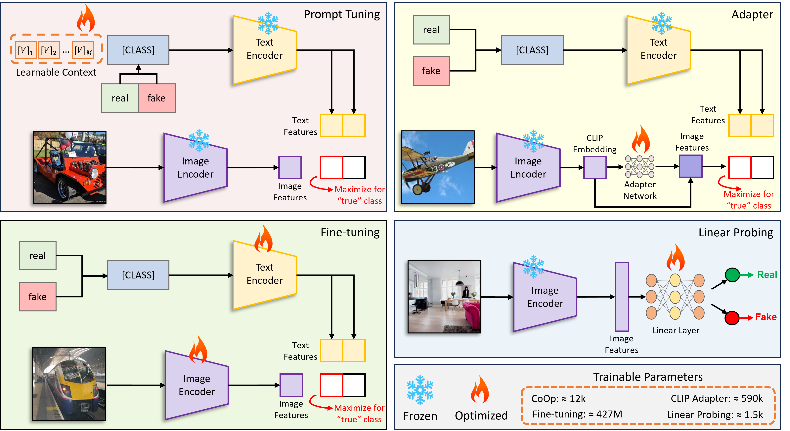

# CLIPping the Deception: Adapting Vision Language Models for Universal Deepfake Detection (Upcoming - ICMR 2024)
Code and pre-trained models for our paper, [CLIPping the Deception: Adapting Vision-Language Models for Universal Deepfake Detection](https://arxiv.org/pdf/2402.12927).



# News
* **May-18-2024:** Added training code for prompt tuning and adapter network
* **May-07-2024:** Added adapter network evaluation code
* **May-06-2024:** Added fine-tuning evaluation code
* **April-30-2024:** Added prompt tuning evaluation code
* **April-15-2024:** Added linear probing evaluation code
* **April-08-2024:** Paper accepted at ICMR 2024

# TODO
* Inference code.
* Code to replicate paper results.
* Training code for Linear Probing and Fine-Tuning.

## Evaluation Dataset
The evaluation dataset can be found [here](https://tinyurl.com/5b3fh7fh).

The dataset is processed as required by [Dassl.pytorch](https://github.com/KaiyangZhou/Dassl.pytorch). For each subset, e.g., StarGAN, two folders can be found each containing **real** - **fake** images. The sample path for StarGAN's evaluation images would be something like: `stargan/images/val/`. In the **val** folder there are two folders, (1) `n01440764` - containing **real** images, (2) `n01443537` - containing **fake** images.

More details about this convention will be included with the **Inference** and **Evaluation** codes (which will be uploaded soon).

## Pre-trained Models
Model weights can be found [here](https://tinyurl.com/nhheyn9r).

**Important!!** <br />
Download and extract **weights.zip** in the same folder as `evaluate.py`

# Installation Guide
This code is built on top of [Dassl.pytorch](https://github.com/KaiyangZhou/Dassl.pytorch), so you need to install the `dassl` environment first. `cd` to `dassl` folder and simply follow the instructions described below: 

```bash
# Clone this repo
git clone https://github.com/sohailahmedkhan/CLIPping-the-Deception.git
cd CLIPping-the-Deception/
cd dassl/

# Create a conda environment
conda create -y -n dassl python=3.8

# Activate the environment
conda activate dassl

# Install torch (requires version >= 1.8.1) and torchvision
# Please refer to https://pytorch.org/ if you need a different cuda version
conda install pytorch torchvision cudatoolkit=10.2 -c pytorch

# Install dependencies
pip install -r requirements.txt

# Install this library (no need to re-build if the source code is modified)
python setup.py develop

cd..
```

After installing dassl, you also need to install [CoOp](https://github.com/KaiyangZhou/CoOp/tree/main), by following instructions given below. 
<br />

All the required files are already available in this repository. Just run `pip install -r requirements.txt` under the main directory to install `CoOp` along with a few more packages required by CLIP (this should be done when dassl is activated). Then, you are ready to go.

If you would like to add more datasets besides the ones in our paper, follow `DATASETS.md` to install the datasets.

# Evaluation
After installing `dassl.pytorch`, just run `evaluate.py` as follows:

### Linear Probing
`python evaluate.py --variant linearProbing --model 100k --dataset [path to downloaded evaluation dataset] --output [path to folder where you would like to save evaluation results]`

### Fine Tuning
`python evaluate.py --variant fineTuning --model 100k --dataset [path to downloaded evaluation dataset] --output [path to folder where you would like to save evaluation results]`

### Prompt Tuning
`python evaluate.py --variant promptTuning --model 100k_16 --dataset [path to downloaded evaluation dataset] --output [path to folder where you would like to save evaluation results]`

### Adapter Network
`python evaluate.py --variant adapterNetwork --model 100k --dataset [path to downloaded evaluation dataset] --output [path to folder where you would like to save evaluation results]`

`--model` argument points to the specific weight file, e.g., `100k` means the model trained using 100k `real` and 100k `fake` images. `16` refers to the size of context window in prompt tuning.


# Training
After installing `dassl.pytorch`, to train your own models, just run `train.py` as follows:

P.S. **32-shot** training dataset can be found [here](https://tinyurl.com/49kanv4a).

### Prompt Tuning
`python train.py --root CLIPping-the-Deception\configs\data --seed 17 --trainer CoOp --dataset-config-file CLIPping-the-Deception\configs\datasets\progan_train.yaml --config-file CLIPping-the-Deception\configs\trainers\CoOp\vit_l14_ep2.yaml --output-dir CLIPping-the-Deception\train_outputs\coop_100k_2epochs TRAINER.COOP.N_CTX 16 TRAINER.COOP.CSC False TRAINER.COOP.CLASS_TOKEN_POSITION front DATASET.NUM_SHOTS 100000`

### Adapter Network
`python train.py --root CLIPping-the-Deception\configs\data --seed 17 --trainer CLIP_Adapter --dataset-config-file CLIPping-the-Deception\configs\datasets\progan_train.yaml --config-file CLIPping-the-Deception\configs\trainers\CoOp\vit_l14_ep2.yaml --output-dir CLIPping-the-Deception\train_outputs\clip_adapter_100k_2epochs DATASET.NUM_SHOTS 100000`

**Important!!** <br />
In order to run training without any errors, please put the training data in the same folder as I did in the commands above i.e., `CLIPping-the-Deception\data`. Also follow the same folder structure inside the `data` folder as below:

```plaintext
# Data Folder Structure

data/
└── progan_train/
    ├── images/
    │   ├── train/
    │   │   ├── n01440764/
    │   │   │   ├── image1.jpg
    │   │   │   ├── image2.jpg
    │   │   │   └── ...
    │   │   ├── n01443537/
    │   │   │   ├── image1.jpg
    │   │   │   ├── image2.jpg
    │   │   │   └── ...
    │   ├── val/
    │   │   ├── n01440764/
    │   │   │   ├── image1.jpg
    │   │   │   ├── image2.jpg
    │   │   │   └── ...
    │   │   ├── n01443537/
    │   │   │   ├── image1.jpg
    │   │   │   ├── image2.jpg
    │   │   │   └── ...

`````
In the paper, I trained all `CoOp` and `Adapter` models for 2 epochs, as it is in the commands above. You are free to change the model config file and train using different training parameters. It is also better if you follow a nice, self explanatory naming convention in the `--output-dir` argument. In the commands I set this to `clip_adapter_100k_2epochs`. This means that I am training the `CLIP_Adapter` on `200k` (100k real and 100k fake) images for `2` epochs.

For training few-shot models, it is better to train them for a higher number of epochs, e.g., the few-shot models in the paper are trained for `20` epochs. 


# Citations
If you use this code in your research, please kindly cite the following papers:
```
@article{khan2024clipping,
  title={CLIPping the Deception: Adapting Vision-Language Models for Universal Deepfake Detection},
  author={Khan, Sohail Ahmed and Dang-Nguyen, Duc-Tien},
  journal={arXiv preprint arXiv:2402.12927},
  year={2024}
}

@inproceedings{zhou2022cocoop,
    title={Conditional Prompt Learning for Vision-Language Models},
    author={Zhou, Kaiyang and Yang, Jingkang and Loy, Chen Change and Liu, Ziwei},
    booktitle={IEEE/CVF Conference on Computer Vision and Pattern Recognition (CVPR)},
    year={2022}
}

@article{zhou2022coop,
    title={Learning to Prompt for Vision-Language Models},
    author={Zhou, Kaiyang and Yang, Jingkang and Loy, Chen Change and Liu, Ziwei},
    journal={International Journal of Computer Vision (IJCV)},
    year={2022}
}
```
